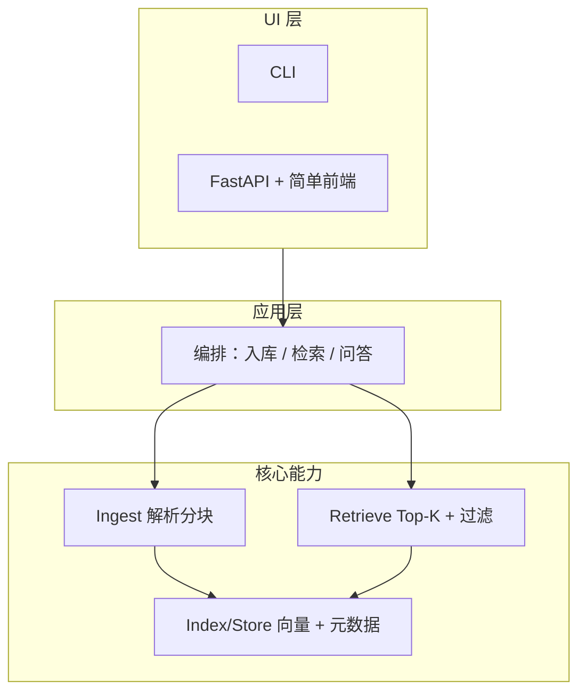
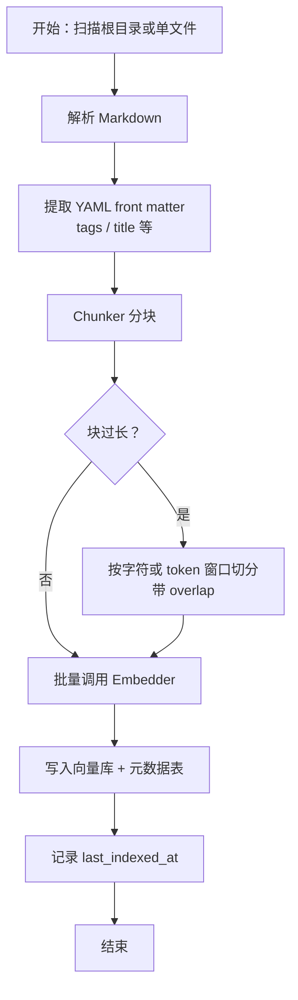
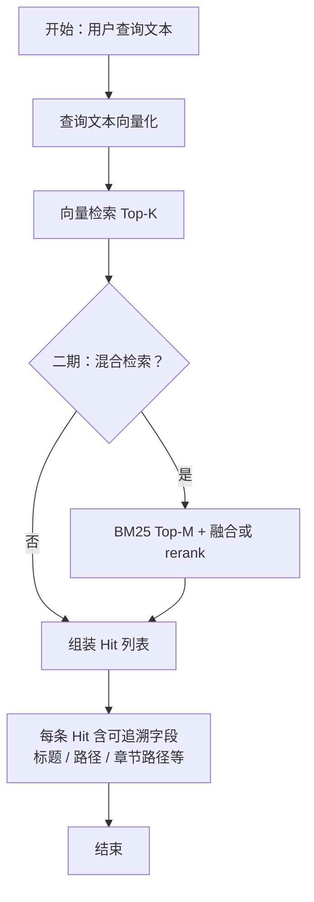
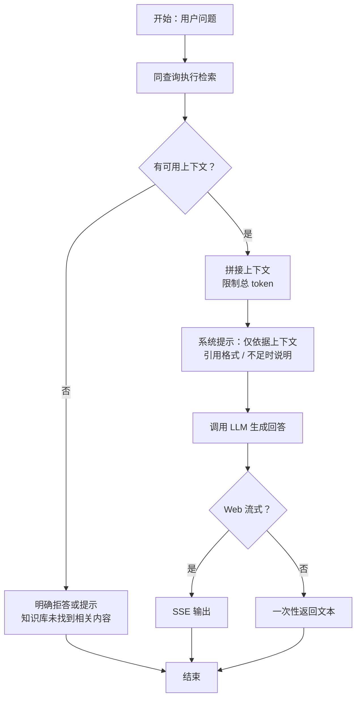
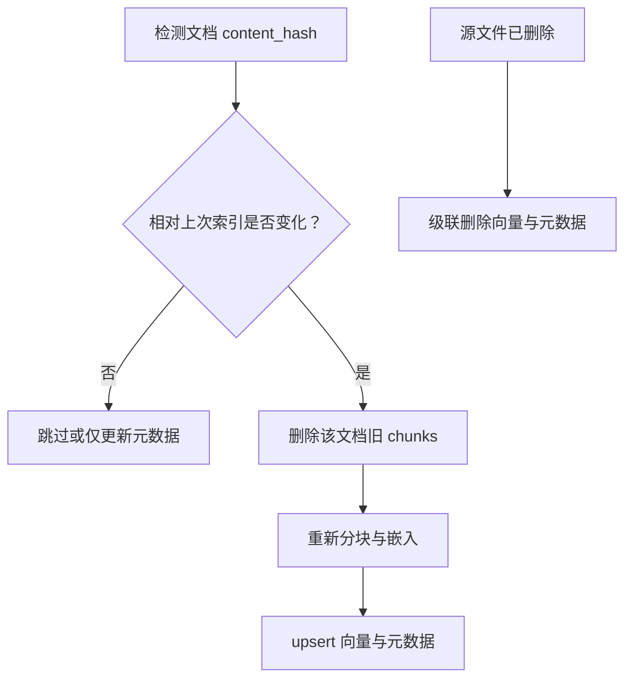

# 个人 AI 知识库 — 流程图

本文档与 `personal-kb-python-dev-plan.md` 第 4～6 节对应，使用 [Mermaid](https://mermaid.js.org/) 绘制，可在 GitHub、VS Code（插件）或任意支持 Mermaid 的 Markdown 预览中渲染。

---

## 1. 逻辑分层（概览）

---

## 2. 入库（Ingest）

**说明**：分块策略为「优先按二级标题切分；过长段落再按窗口切分」（见开发方案 6.1）。

---

## 3. 检索（Retrieve）

---

## 4. 问答（RAG，可选）

---

## 5. 文档变更与一致性（摘要）

---

*修订：与开发方案文档同步维护即可。*
